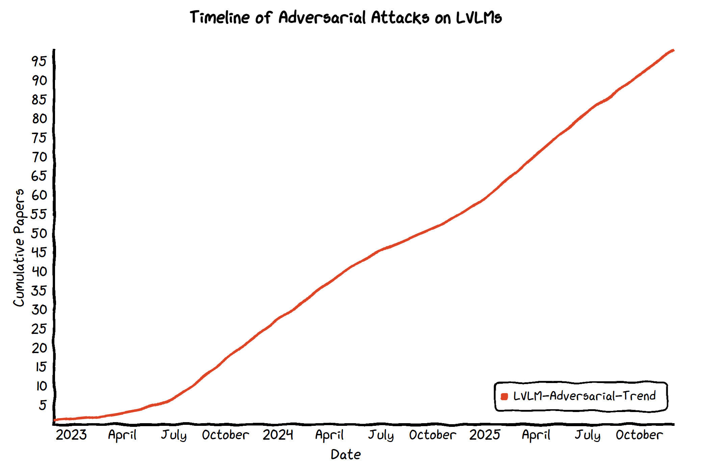

# Awesome-LVLM-Adversarial-Attack

Ready to dive into the world of adversarial attacks on Large Vision-Language Models (LVLMs)? 🧠💥 This collection of papers and repos is your secret weapon for exploring the wild side of AI! 🚀 From sneaky inputs that confuse multimodal models to mind-bending techniques that expose hidden vulnerabilities, you'll find everything you need to push LVLMs to their limits. 🤖💡 Whether you're a curious researcher, a coding wizard, or just someone who loves seeing AI get a little "messed with," these resources will inspire you to think outside the box and level up the security and performance of the models we rely on. 🔒🔍 So, what are you waiting for? Jump in and let's break (and fix) some AI! 😎⚡

| Title                                                        |  Setting  |   Type   |      Method      |         **Key-Focus**         |                **Scenario**                 |
| :----------------------------------------------------------- | :-------: | :------: | :--------------: | :---------------------------: | :-----------------------------------------: |
| V-Attack: Targeting Disentangled Value Features for Controllable Adversarial Attacks on LVLMs | Black-box |  Target  |  Gradient-based  |        Transferability        |            VQA, Image Captioning            |
| ADVLA: Attention-Guided, Patch-Wise Sparse Adversarial Attacks on Vision-Language-Action Model | Gray-box  | Untarget |  Gradient-based  |   Efficiency, Stealthiness    |                 Embodied Ai                 |
| On the Feasibility of Hijacking MLLMs’ Decision Chain via One Perturbation | White-box |  Target  |  Gradient-based  |         Universality          |       Autonomous Driving, Embodied Ai       |
| Turning Adversaries into Allies: Reversing Typographic Attacks for Multimodal E-Commerce Product Retrieval | Black-box |  Target  | Typography-based |          Efficiency           |            image-text retrieval             |
| Model-agnostic Adversarial Attack and Defense for Vision-Language-Action Models | Gray-box  | Untarget |  Gradient-based  | Universality, Transferability |                 Embodied Ai                 |
| Gradient Pruning Interactive Attack for Vision-Language Pre-training Models | Black-box | Untarget |  Gradient-based  |        Transferability        |            image-text retrieval             |
| Universal Camouflage Attack on Vision-Language Models for Autonomous Driving | White-box | Untarget |  Gradient-based  |         Universality          |             Autonomous Driving              |
| Fit the Distribution: Cross-Image/Prompt Adversarial Attacks on Multimodal Large Language Models | Black-box |  Target  |  Gradient-based  |        Transferability        |            VQA, Image Captioning            |
| HQA-VLAttack: Towards High Quality Adversarial Attack on Vision-Language Pre-Trained Models | Black-box |  Target  |  Gradient-based  |        Transferability        | VQA, Image Captioning, image-text retrieval |
| Phi: Preference Hijacking in Multi-modal Large Language Models at Inference Time | White-box |  Target  |  Gradient-based  |         Universality          |            VQA, Image Captioning            |
| ADVEDM:Fine-grained Adversarial Attack against VLM-based Embodied Agents | Gray-box  |  Target  |  Gradient-based  |         Stealthiness          |       Autonomous Driving, Embodied Ai       |
| GeoShield: Safeguarding geolocation privacy from vision-language models via adversarial perturbations | Black-box | Untarget |  Gradient-based  |        Transferability        |             Privacy Protection              |
| Towards Mechanistic Defenses Against Typographic Attacks in CLIP | White-box | Untarget | Typography-based |         Stealthiness          |            image-text retrieval             |
| VIP: Visual Information Protection through Adversarial Attacks on Vision-Language Models | White-box |  Target  |  Gradient-based  |   Stealthiness, Efficiency    |  Privacy Protection, VQA, Image Captioning  |
| CAVALRY-V: A Large-Scale Generator Framework for Adversarial Attacks on Video MLLMs | Black-box | Untarget |  Gradient-based  |  Transferability, Efficiency  |                   others                    |
| Resource Consumption Red-Teaming for Large Vision-Language Models | White-box |  Target  |  Gradient-based  |          Efficiency           |                   others                    |
| VEAttack: Downstream-agnostic Vision Encoder Attack against Large Vision Language Models | White-box | Untarget |  Gradient-based  |  Transferability, Efficiency  |            VQA, Image Captioning            |
| Revisiting CroPA: A Reproducibility Study and Enhancements for Cross-Prompt Adversarial Transferability in Vision-Language Models | White-box |  Target  |  Gradient-based  |        Transferability        |            VQA, Image Captioning            |
| Mirage in the Eyes: Hallucination Attack on Multi-modal Large Language Models with Only Attention Sink | Black-box | Untarget |  Gradient-based  |        Transferability        |            VQA, Image Captioning            |
| Seeing the Threat: Vulnerabilities in Vision-Language Models to Adversarial Attack | White-box | Untarget |  Gradient-based  |         Stealthiness          |               Vulnerabilities               |
| Transferable Adversarial Attacks on Black-Box Vision-Language Models | Black-box |  Target  |  Gradient-based  | Transferability, Universality |            VQA, Image Captioning            |
| Adversarial Attacks against Closed-Source MLLMs via Feature Optimal Alignment | Black-box |  Target  |  Gradient-based  |        Transferability        |            VQA, Image Captioning            |
| Safeguarding Vision-Language Models: Mitigating Vulnerabilities to Gaussian Noise in Perturbation-based Attacks | White-box | Untarget |  Gradient-based  |         Stealthiness          |               Vulnerabilities               |
| Transfer Attack for Bad and Good: Explain and Boost Adversarial Transferability across Multimodal Large Language Models | Black-box |  Target  | Typography-based |        Transferability        |             Privacy Protection              |
| X-Transfer Attacks: Towards Super Transferable Adversarial Attacks on CLIP | Black-box | Untarget |  Gradient-based  | Universality, Transferability | VQA, Image Captioning, image-text retrieval |
| Manipulating Multimodal Agents via Cross-Modal Prompt Injection | Black-box |  Target  |  Gradient-based  |        Transferability        |       Embodied Ai, Autonomous Driving       |
| AdPO: Enhancing the Adversarial Robustness of Large Vision-Language Models with Preference Optimization | White-box | Untarget |  Gradient-based  |          Efficiency           |            VQA, Image Captioning            |
| A Frustratingly Simple Yet Highly Effective Attack Baseline: Over 90% Success Rate Against the Strong Black-box Models of GPT-4.5/4o/o1 | Black-box |  Target  |  Gradient-based  |        Transferability        |            VQA, Image Captioning            |
| Imperceptible Transfer Attack on Large Vision-Language Models | White-box | Untarget |  Gradient-based  | Transferability, Stealthiness |            VQA, Image Captioning            |
| QAVA: Query-Agnostic Visual Attack to Large Vision-Language Models | Gray-box  | Untarget |  Gradient-based  |         Universality          |            VQA, Image Captioning            |
| Semantic-Aligned Adversarial Evolution Triangle for High-Transferability Vision-Language Attack | White-box | Untarget |  Gradient-based  |        Transferability        | image-text retrieval, Image Captioning, VQA |
| Doubly-Universal Adversarial Perturbations: Deceiving Vision-Language Models Across Both Images and Text with a Single Perturbation | Gray-box  | Untarget |  Gradient-based  |         Universality          | VQA, Image Captioning, image-text retrieval |
| Pandora’s Box: Towards Building Universal Attackers against Real-World Large Vision-Language Models | Black-box |  Target  |   Query-based    |         Universality          | VQA, Image Captioning, image-text retrieval |
| Break the Visual Perception: Adversarial Attacks Targeting Encoded Visual Tokens of Large Vision-Language Models | Gray-box  | Untarget |  Gradient-based  |        Transferability        |            VQA, Image Captioning            |
| AnyAttack: Towards Large-scale Self-supervised Adversarial Attacks on Vision-language Models | White-box |  Target  |  Gradient-based  |        Transferability        |   image-text retrieval, Image Captioning    |
| Enhancing Targeted Adversarial Attacks on Large Vision-Language Models via Intermediate Projector | Black-box |  Target  |  Gradient-based  |        Transferability        |            VQA, Image Captioning            |
| MAA: Meticulous Adversarial Attack against Vision-Language Pre-trained Models | White-box | Untarget |  Gradient-based  |        Transferability        | image-text retrieval, Image Captioning, VQA |
| Improving Adversarial Transferability in MLLMs via Dynamic Vision-Language Alignment Attack | Gray-box  |  Target  |  Gradient-based  |        Transferability        |            VQA, Image Captioning            |
| Typographic Attacks in a Multi-Image Setting                 | Black-box | Untarget | Typography-based |         Stealthiness          |            image-text retrieval             |
| Universal Adversarial Attack on Multimodal Aligned LLMs      | White-box |  Target  |  Gradient-based  |         Universality          |                   others                    |
| Tracking the Copyright of Large Vision-Language Models through Parameter Learning Adversarial Images | White-box |  Target  |  Gradient-based  |         Universality          |             Privacy Protection              |
| Effective Black-Box Multi-Faceted Attacks Breach Vision Large Language Model Guardrails | Black-box |  Target  |   Query-based    |        Transferability        |                   others                    |
| An Image Is Worth 1000 Lies: Adversarial Transferability across Prompts on Vision-Language Models | Black-box |  Target  |  Gradient-based  | Transferability, Universality |            VQA, Image Captioning            |
| One Prompt Word Is Enough to Boost Adversarial Robustness for Pre-trained Vision-Language Models | White-box | Untarget |  Gradient-based  |          Efficiency           |                   others                    |
| AI Safety in Practice: Enhancing Adversarial Robustness in Multimodal Image Captioning | White-box | Untarget |  Gradient-based  |          Efficiency           |              Image Captioning               |
| Refusing Safe Prompts for Multi-modal Large Language Models  | White-box |  Target  |  Gradient-based  |         Stealthiness          |            VQA, Image Captioning            |
| Manipulation Facing Threats: Evaluating Physical Vulnerabilities in End-to-End Vision Language Action Models | Black-box | Untarget | Typography-based |         Universality          |                 Embodied Ai                 |
| One Perturbation is Enough: On Generating Universal Adversarial Perturbations against Vision-Language Pre-training Models | Black-box | Untarget |  Gradient-based  | Universality, Transferability |   image-text retrieval, Image Captioning    |
| Improving Adversarial Transferability of Vision-Language Pre-training Models through Collaborative Multimodal Interaction | Black-box | Untarget |  Gradient-based  |        Transferability        |   image-text retrieval, Image Captioning    |
| Exploring the Transferability of Visual Prompting for Multimodal Large Language Models | Black-box | Untarget |  Gradient-based  |        Transferability        |                   others                    |
| Boosting Transferability in Vision-Language Attacks via Diversification along the Intersection Region of Adversarial Trajectory | Black-box | Untarget |  Gradient-based  |        Transferability        | image-text retrieval, VQA, Image Captioning |
| Medical MLLM Is Vulnerable: Cross-Modality Jailbreak and Mismatched Attacks on Medical Multimodal Large Language Models | Gray-box  |  Target  |  Gradient-based  |         Universality          |             Privacy Protection              |
| Dissecting Adversarial Robustness of Multimodal LM Agents    | Black-box |  Target  |  Gradient-based  |         Universality          |                 Embodied Ai                 |
| Towards Transferable Attacks Against Vision-LLMs in Autonomous Driving with Typography | Black-box |  Target  | Typography-based |        Transferability        |             Autonomous Driving              |
| Efficient Generation of Targeted and Transferable Adversarial Examples for Vision-Language Models via Diffusion Models | Black-box |  Target  |  Gradient-based  |  Efficiency, Transferability  |            VQA, Image Captioning            |
| Adversarial Robustness for Visual Grounding of Multimodal Large Language Models | White-box |  Target  |  Gradient-based  |         Universality          |                   others                    |
| On the Robustness of Large Multimodal Models Against Image Adversarial Attacks | White-box | Untarget |  Gradient-based  |         Universality          |            VQA, Image Captioning            |
| SA-Attack: Improving Adversarial Transferability of Vision-Language Pre-training Models via Self-Augmentation | Black-box | Untarget |  Gradient-based  |        Transferability        |            image-text retrieval             |
| OT-Attack: Enhancing Adversarial Transferability of Vision-Language Models via Optimal Transport Optimization | Black-box | Untarget |  Gradient-based  |        Transferability        |            image-text retrieval             |
| FigStep: Jailbreaking Large Vision-Language Models via Typographic Visual Prompts | Black-box |  Target  | Typography-based |         Stealthiness          |                   others                    |
| How Many Are in This Image? A Safety Evaluation Benchmark for Vision LLMs | Black-box | Untarget |  Gradient-based  |         Universality          |            VQA, Image Captioning            |
| On the Adversarial Robustness of Multi-Modal Foundation Models | White-box |  Target  |  Gradient-based  |         Stealthiness          |            Image Captioning, VQA            |
| Image Hijacks: Adversarial Images can Control Generative Models at Runtime | White-box |  Target  |  Gradient-based  |         Universality          |                   others                    |
| Misusing Tools in Large Language Models with Visual Adversarial Examples | White-box |  Target  |  Gradient-based  |         Stealthiness          |              Privacy Violation              |
| AdvCLIP: Downstream-agnostic Adversarial Examples in Multimodal Contrastive Learning | Gray-box  | Untarget |  Gradient-based  |         Universality          |            image-text retrieval             |
| Adversarial Illusions in Multi-Modal Embeddings              | Black-box |  Target  |  Gradient-based  | Universality, Transferability |        image-text retrieval, others         |
| Exploring Transferability of Multimodal Adversarial Samples for Vision-Language Pre-training Models with Contrastive Learning | Black-box | Untarget |  Gradient-based  |        Transferability        | image-text retrieval, VQA, Image Captioning |
| Downstream-agnostic Adversarial Examples                     | White-box | Untarget |  Gradient-based  | Universality, Transferability |        image-text retrieval, others         |
| Set-level Guidance Attack: Boosting Adversarial Transferability of Vision-Language Pre-training Models | Gray-box  | Untarget |  Gradient-based  |        Transferability        |   image-text retrieval, Image Captioning    |
| Abusing Images and Sounds for Indirect Instruction Injection in Multi-Modal LLMs | Black-box |  Target  |  Gradient-based  |         Stealthiness          |            VQA, Image Captioning            |
| Visual Adversarial Examples Jailbreak Aligned Large Language Models | White-box |  Target  |  Gradient-based  |         Universality          |            VQA, Image Captioning            |
| Jailbreak in Pieces: Compositional Adversarial Attacks on Multi-Modal Language Models | Gray-box  |  Target  |  Gradient-based  |        Transferability        |            VQA, Image Captioning            |
| Towards Adversarial Attack on Vision-Language Pre-training Models | White-box | Untarget |  Gradient-based  |        Transferability        |          image-text retrieval, VQA          |
| Defense-Prefix for Preventing Typographic Attacks on CLIP    | White-box | Untarget | Typography-based |         Stealthiness          |        image-text retrieval, others         |
| Rethinking Model Ensemble in Transfer-based Adversarial Attacks | Black-box | Untarget |  Gradient-based  |        Transferability        |                   others                    |
| On Evaluating Adversarial Robustness of Large Vision-Language Models | Black-box |  Target  |  Gradient-based  |        Transferability        |            VQA, Image Captioning            |
| PhysPatch: A Physically Realizable and Transferable Adversarial Patch Attack for Multimodal Large Language Models-based Autonomous Driving Systems | Gray-box  |  Target  |  Gradient-based  |        Transferability        |             Autonomous Driving              |
| Towards Building Model/Prompt-Transferable Attackers against Large Vision-Language Models | White-box |  Target  |  Gradient-based  |        Transferability        |            VQA, Image Captioning            |
| Black-Box Adversarial Attack on Vision Language Models for Autonomous Driving | Black-box | Untarget |   Query-based    |         Universality          |             Autonomous Driving              |
| Transferability of Adversarial Attacks in Video-based MLLMs: A Cross-modal Image-to-Video Approach | Black-box | Untarget |  Gradient-based  |        Transferability        |                     VQA                     |
| Attention! Your Vision Language Model Could Be Maliciously Manipulated | White-box |  Target  |  Gradient-based  |         Universality          |             Privacy Protection              |
| Chain of Attack: On the Robustness of Vision-Language Models Against Transfer-Based Adversarial Attacks | Black-box |  Target  |  Gradient-based  |  Transferability, Efficiency  |            VQA, Image Captioning            |
| Replace-then-Perturb: Targeted Adversarial Attacks With Visual Reasoning for Vision-Language Models | White-box |  Target  |  Gradient-based  |         Stealthiness          |            VQA, Image Captioning            |
| SCENETAP: Scene-Coherent Typographic Adversarial Planner against Vision-Language Models in Real-World Environments | Black-box |  Target  | Typography-based |  Stealthiness, Universality   |            VQA, Image Captioning            |
| PG-Attack: A Precision-Guided Adversarial Attack Framework Against Vision Foundation Models for Autonomous Driving | Black-box |  Target  |  Gradient-based  |         Stealthiness          |             Autonomous Driving              |
| B-AVIBench: Towards Evaluating the Robustness of Large Vision-Language Model on Black-box Adversarial Visual-Instructions | Black-box | Untarget |   Query-based    |        Transferability        |            Image-text retrieval             |
| Visual Adversarial Attack on Vision-Language Models for Autonomous Driving | White-box |  Target  |  Gradient-based  |        Transferability        |             Autonomous Driving              |
| Stop Reasoning! When Multimodal LLM with Chain-of-Thought Reasoning Meets Adversarial Image | White-box |  Target  |  Gradient-based  |          Efficiency           |                     VQA                     |
| The Wolf Within: Covert Injection of Malice into MLLM Societies via An MLLM Operative | White-box |  Target  |  Gradient-based  |        Transferability        |                   others                    |
| Unveiling Typographic Deceptions: Insights of the Typographic Vulnerability in Large Vision-Language Models | Black-box | Untarget | Typography-based |         Universality          |                     VQA                     |
| On the Vulnerability of LLM/VLM-Controlled Robotics          | Black-box | Untarget |   Query-based    |         Universality          |                 Embodied Ai                 |
| Vision-LLMs Can Fool Themselves with Self-Generated Typographic Attacks | Black-box |  Target  | Typography-based |         Universality          |            VQA, Image Captioning            |
| How Robust is Google’s Bard to Adversarial Image Attacks?    | Black-box |  Target  |  Gradient-based  |        Transferability        |              Image Captioning               |
| VLATTACK: Multimodal Adversarial Attacks on Vision-Language Tasks via Pre-trained Models | Black-box | Untarget |  Gradient-based  |        Transferability        |                     VQA                     |
| Mutual-modality Adversarial Attack with Semantic Perturbation | Black-box | Untarget |  Gradient-based  |        Transferability        |            image-text retrieval             |
| InstructTA: Instruction-Tuned Targeted Attack for Large Vision-Language Models | Gray-box  |  Target  |  Gradient-based  |        Transferability        |                     VQA                     |
| Transferable Multimodal Attack on Vision-Language Pre-training Models | Black-box | Untarget |  Gradient-based  |        Transferability        |            image-text retrieval             |

## Papers

* **V-Attack: Targeting Disentangled Value Features for Controllable Adversarial Attacks on LVLMs**|[arXiv 2025](https://arxiv.org/abs/2511.20223)|[Github](https://github.com/Summu77/V-Attack) 
* **Attention-Guided Patch-Wise Sparse Adversarial Attacks on Vision-Language-Action Models**|[arXiv 2025](https://arxiv.org/abs/2511.21663)
* **On the Feasibility of Hijacking MLLMs’ Decision Chain via One Perturbation**|[arXiv 2025](https://arxiv.org/abs/2511.20002)
* **Turning Adversaries into Allies: Reversing Typographic Attacks for Multimodal E-Commerce Product Retrieval**|[arXiv 2025](https://arxiv.org/abs/2511.05325)
* **Transfer Attack for Bad and Good: Explain and Boost Adversarial Transferability across Multimodal Large Language Models**|[ACM MM 2025](https://dl.acm.org/doi/abs/10.1145/3746027.3755715)
* **Model-agnostic Adversarial Attack and Defense for Vision-Language-Action Models**|[arXiv 2025](https://arxiv.org/abs/2510.13237)|[Page](https://edpa-attack.github.io/)| [Github](https://github.com/trustmlyoungscientist/EDPA_attack_defense) 
* **Gradient Pruning Interactive Attack for Vision-Language Pre-training Models**|[TDSC 2025](https://ieeexplore.ieee.org/abstract/document/11217326)
* **Universal Camouflage Attack on Vision-Language Models for Autonomous Driving**|[arXiv 2025](https://arxiv.org/abs/2509.20196)
* **HQA-VLAttack: Towards High Quality Adversarial Attack on Vision-Language Pre-Trained Models**|[NeurIPS 2025](https://openreview.net/forum?id=LZ4IKybwWl)
* **Fit the Distribution: Cross-Image/Prompt Adversarial Attacks on Multimodal Large Language Models**|[NeurIPS 2025](https://openreview.net/pdf?id=kn0AyMYw0v)
* **Towards Building Model/Prompt-Transferable Attackers against Large Vision-Language Models** |[NeurIPS 2025](https://openreview.net/pdf?id=TyW1V1KukG)
* **Phi: Preference Hijacking in Multi-modal Large Language Models at Inference Time** |[EMNLP 2025](https://arxiv.org/abs/2509.12521)| [Github](https://github.com/Yifan-Lan/Phi) 
* **ADVEDM:Fine-grained Adversarial Attack against VLM-based Embodied Agents** |[NeurIPS 2025](https://arxiv.org/pdf/2509.16645)| [Page](https://advedm.github.io/demo/)
* **Geoshield: Safeguarding geolocation privacy from vision-language models via adversarial perturbations**|[AAAI 2026](https://arxiv.org/abs/2508.03209)|[Github](https://github.com/thinwayliu/Geoshield)
* **PhysPatch: A Physically Realizable and Transferable Adversarial Patch Attack for Multimodal Large Language Models-based Autonomous Driving Systems** |[Arxiv 2025](https://arxiv.org/abs/2508.05167)
* **Towards Mechanistic Defenses Against Typographic Attacks in CLIP**|[arXiv 2025](https://arxiv.org/abs/2508.20570)
* **Enhancing Targeted Adversarial Attacks on Large Vision-Language Models via Intermediate Projector**|[arXiv 2025](https://arxiv.org/abs/2508.13739)
* **VIP: Visual Information Protection through Adversarial Attacks on Vision-Language Models**|[arXiv 2025](https://arxiv.org/abs/2507.08982)| [Github](https://github.com/hbrachemi/Vlm_defense-attack)
* **CAVALRY-V: A Large-Scale Generator Framework for Adversarial Attacks on Video MLLMs** | [arXiv 2025](https://arxiv.org/abs/2507.00817)
* **Resource Consumption Red-Teaming for Large Vision-Language Models** | [arXiv 2025](https://arxiv.org/abs/2507.18053)
* **Revisiting CroPA: A Reproducibility Study and Enhancements for Cross-Prompt Adversarial Transferability in Vision-Language Models** |[MLRC 2025](https://arxiv.org/abs/2506.22982)| [Page](https://jiamingzhang94.github.io/cavalry/) | [Github](https://github.com/jiamingzhang94/CAVALRY-V) 
* **VEAttack: Downstream-agnostic Vision Encoder Attack against Large Vision Language Models** |[arXiv 2025](https://arxiv.org/abs/2505.17440)| [Github](https://github.com/hefeimei06/VEAttack-LVLM) 
* **Attention! You Vision Language Model Could Be Maliciously Manipulated** |[NeurIPS 2025](https://arxiv.org/abs/2505.19911)| [Github](https://github.com/Trustworthy-AI-Group/VMA) 
* **Adversarial Attacks against Closed-Source MLLMs via Feature Optimal Alignment** |[NeurIPS 2025](https://arxiv.org/abs/2505.21494)|[Github](https://github.com/jiaxiaojunQAQ/FOA-Attack) 
* **Transferable Adversarial Attacks on Black-Box Vision-Language Models**|[arXiv 2025](https://arxiv.org/abs/2505.01050)
* **Seeing the Threat: Vulnerabilities in Vision-Language Models to Adversarial Attack** |[arXiv 2025](https://arxiv.org/abs/2505.21967)
* **X-Transfer Attacks: Towards Super Transferable Adversarial Attacks on CLIP** |[ICML 2025](https://arxiv.org/abs/2505.05528)|  [Github](https://github.com/HanxunH/XTransferBench) 
* **Safeguarding Vision-Language Models: Mitigating Vulnerabilities to Gaussian Noise in Perturbation-based Attacks**|[ICCV 2025](https://arxiv.org/abs/2504.01308)| [Github](https://github.com/JarvisUSTC/DiffPure-RobustVLM) 
* **AdPO: Enhancing the Adversarial Robustness of Large Vision-Language Models with Preference Optimization**|[arXiv 2025](https://arxiv.org/abs/2504.01735)
* **Manipulating Multimodal Agents via Cross-Modal Prompt Injection** |[arXiv 2025](https://arxiv.org/abs/2504.14348)
* **QAVA: Query-Agnostic Visual Attack to Large Vision-Language Models**|[NAACL 2025](https://arxiv.org/abs/2504.11038)|[Github](https://github.com/btzyd/qava) 
* **Imperceptible Transfer Attack on Large Vision-Language Models** |[ICASSP 2025](https://ieeexplore.ieee.org/abstract/document/10890065/)
* **A Frustratingly Simple Yet Highly Effective Attack Baseline: Over 90% Success Rate Against the Strong Black-box Models of GPT-4.5/4o/o1**|[[NeurIPS 2025](https://arxiv.org/abs/2503.10635)|[Page](https://vila-lab.github.io/M-Attack-Website/)|[Github](https://github.com/VILA-Lab/M-Attack)
* **Effective Black-Box Multi-Faceted Attacks Breach Vision Large Language Model Guardrails** |[arXiv 2025](https://arxiv.org/abs/2502.05772)
* **MAA: Meticulous Adversarial Attack against Vision-Language Pre-trained Models**|[arXiv 2025](https://arxiv.org/abs/2502.08079)
* **Tracking the Copyright of Large Vision-Language Models through Parameter Learning Adversarial Images**|[ICLR 2025](https://arxiv.org/abs/2502.16593)
* **Universal Adversarial Attack on Multimodal Aligned LLMs** |[arXiv 2025](https://arxiv.org/abs/2502.07987)
* **Typographic Attacks in a Multi-Image Setting**|[NAACL 2025](https://arxiv.org/abs/2502.08193)|[Github](https://github.com/XiaomengWang-AI/Typographic-Attacks-in-a-Multi-Image-Setting) 
* **Improving Adversarial Transferability in MLLMs via Dynamic Vision-Language Alignment Attack** |[arXiv 2025](https://arxiv.org/abs/2502.19672)
* **Mirage in the Eyes: Hallucination Attack on Multi-modal Large Language Models with Only Attention Sink**|[USENIX Security 2025](https://arxiv.org/abs/2501.15269)|[Hugging Face](https://huggingface.co/RachelHGF/Mirage-in-the-Eyes)
* **Transferability of Adversarial Attacks in Video-based MLLMs: A Cross-modal Image-to-Video Approach** |[arXiv 2025](https://arxiv.org/abs/2501.01042)
* **Black-Box Adversarial Attack on Vision Language Models for Autonomous Driving**|[arXiv 2025](https://arxiv.org/abs/2501.13563)
* **Doubly-Universal Adversarial Perturbations: Deceiving Vision-Language Models Across Both Images and Text with a Single Perturbation** |[arXiv 2024](https://arxiv.org/abs/2412.08108)
* **SceneTAP: Scene-Coherent Typographic Adversarial Planner against Vision-Language Models in Real-World Environments**|[CVPR 2025](https://arxiv.org/abs/2412.00114)|[Github](https://github.com/tsingqguo/scenetap)
* **Replace-then-Perturb: Targeted Adversarial Attacks With Visual Reasoning for Vision-Language Models**| [arXiv 2024](https://arxiv.org/abs/2411.00898)
* **Chain of Attack: On the Robustness of Vision-Language Models Against Transfer-Based Adversarial Attacks**|[arXiv 2024](https://arxiv.org/abs/2411.15720)
* **Visual Adversarial Attack on Vision-Language Models for Autonomous Driving**|[arXiv 2024](https://arxiv.org/abs/2411.18275)
* **Semantic-Aligned Adversarial Evolution Triangle for High-Transferability Vision-Language Attack**|[TPAMI 2025](https://arxiv.org/abs/2411.02669)|[Github](https://github.com/jiaxiaojunQAQ/SA-AET)
* **AnyAttack: Towards Large-scale Self-supervised Generation of Targeted Adversarial Examples for Vision-Language Models**|[CVPR 2025](https://arxiv.org/abs/2410.05346)| [Github](https://github.com/jiamingzhang94/AnyAttack) 
* **Break the Visual Perception: Adversarial Attacks Targeting Encoded Visual Tokens of Large Vision-Language Models**|[ACMMM 2024](https://arxiv.org/abs/2410.06699)
* **Pandora's Box: Towards Building Universal Attackers against Real-World Large Vision-Language Models** |[NeurIPS2024](https://proceedings.neurips.cc/paper_files/paper/2024/hash/5d516fc09b53e9a7fade4fbad703e686-Abstract-Conference.html)

* **Manipulation Facing Threats: Evaluating Physical Vulnerabilities in End-to-End Vision Language Action Models** |[arXiv 2024](https://arxiv.org/abs/2409.13174)| [Page](https://chaducheng.github.io/Manipulate-Facing-Threats/)
* **Refusing Safe Prompts for Multi-modal Large Language Models** |[arXiv 2024](https://arxiv.org/abs/2407.09050)| [Github](https://github.com/Sadcardation/MLLM-Refusal) 
* **AI Safety in Practice: Enhancing Adversarial Robustness in Multimodal Image Captioning**|[KDD Workshop 2024](https://arxiv.org/abs/2407.21174)
* **PG-Attack: A Precision-Guided Adversarial Attack Framework Against Vision Foundation Models for Autonomous Driving** |[CIVPR Workshop 2024](https://arxiv.org/abs/2407.13111)|[Github](https://github.com/fuhaha824/PG-Attack)
* **One Perturbation is Enough: On Generating Universal Adversarial Perturbations against Vision-Language Pre-training Models**|[ICCV 2025](https://openaccess.thecvf.com/content/ICCV2025/html/Fang_One_Perturbation_is_Enough_On_Generating_Universal_Adversarial_Perturbations_against_ICCV_2025_paper.html)|[Github](https://github.com/ffhibnese/CPGC_VLP_Universal_Attacks)
* **Dissecting Adversarial Robustness of Multimodal LM Agents** |[ICLR 2025](https://arxiv.org/abs/2406.12814)| [Github ](https://github.com/ChenWu98/agent-attack)
* **Towards Transferable Attacks Against Vision-LLMs in Autonomous Driving with Typography**|[arXiv 2024](https://arxiv.org/abs/2405.14169)
* **Medical MLLM is Vulnerable: Cross-Modality Jailbreak and Mismatched Attacks on Medical Multimodal Large Language Models** |[Arxiv 2024](https://arxiv.org/abs/2405.20775)| [Github](https://github.com/dirtycomputer/O2M_attack)
* **Adversarial Robustness for Visual Grounding of Multimodal Large Language Models** |[ICLR workshop 2024](https://arxiv.org/abs/2405.09981)
* **Efficiently Adversarial Examples Generation for Visual-Language Models under Targeted Transfer Scenarios using Diffusion Models** |[TIFS](https://arxiv.org/abs/2404.10335)| [Github](https://github.com/gq-max/AdvDiffVLM) 
* **Exploring the Transferability of Visual Prompting for Multimodal Large Language Models** |[CVPR 2024](https://arxiv.org/abs/2404.11207)| [Github](https://github.com/zycheiheihei/Transferable-Visual-Prompting) 
* **One Prompt Word is Enough to Boost Adversarial Robustness for Pre-trained Vision-Language Models**|[CVPR 2024](https://arxiv.org/abs/2403.01849)|[Github](https://github.com/TreeLLi/APT)
* **Improving Adversarial Transferability of Vision-Language Pre-training Models through Collaborative Multimodal Interaction**|[CVPR Workshop 2024](https://arxiv.org/abs/2403.10883)
* **An Image Is Worth 1000 Lies: Transferability of Adversarial Images across Prompts on Vision-Language Models**| [ICLR 2024](https://arxiv.org/abs/2403.09766)| [Github](https://github.com/Haochen-Luo/CroPA) 
* **Boosting Transferability in Vision-Language Attacks via Diversification Along the Intersection Region of Adversarial Trajectory**|[ECCV 2024](https://arxiv.org/abs/2403.12445)|[Github](https://github.com/SensenGao/VLPTransferAttack)
* **B-AVIBench: Towards Evaluating the Robustness of Large Vision-Language Model on Black-box Adversarial Visual-Instructions** | [TIFS](https://arxiv.org/abs/2403.09346)| [Github](https://github.com/zhanghao5201/B-AVIBench) 
* **Unveiling Typographic Deceptions: Insights of the Typographic Vulnerability in Large Vision-Language Model**|[[ECCV 2024](https://arxiv.org/abs/2402.19150)|[Github](https://github.com/ChaduCheng/TypoDeceptions) 
* **The Wolf Within: Covert Injection of Malice into MLLM Societies via an MLLM Operative**| [CVPR Workshop 2024](https://arxiv.org/abs/2402.14859)| [Github](https://github.com/ChengshuaiZhao0/The-Wolf-Within) 
* **Stop Reasoning! When Multimodal LLMs with Chain-of-Thought Reasoning Meets Adversarial Images** |[COLM 2024](https://arxiv.org/abs/2402.14899)| [Github](https://github.com/aiPenguin/StopReasoning) 
* **Vision-LLMs Can Fool Themselves with Self-Generated Typographic Attacks**|[arXiv 2024](https://arxiv.org/abs/2402.00626)|[Github](https://github.com/mqraitem/Self-Gen-Typo-Attack)
* **On the Vulnerability of LLM/VLM-Controlled Robotics** | [arXiv 2024](https://arxiv.org/abs/2402.10340)
* **Inducing High Energy-Latency of Large Vision-Language Models with Verbose Images** | [ICLR 2024](https://arxiv.org/abs/2401.11170)| [Github](https://github.com/KuofengGao/Verbose_Images) 
* **Transferable Multimodal Attack on Vision-Language Pre-training Models** |[S&P 2024](https://www.computer.org/csdl/proceedings-article/sp/2024/313000a102/1Ub239H4xyg)
* **InstructTA: Instruction-Tuned Targeted Attack for Large Vision-Language Models** | [arXiv 2023](https://arxiv.org/abs/2312.01886)| [Github](https://github.com/xunguangwang/InstructTA) 
* **Mutual-modality Adversarial Attack with Semantic Perturbation**| [AAAI 2024](https://arxiv.org/abs/2312.12768)
* **OT-Attack: Enhancing Adversarial Transferability of Vision-Language Models via Optimal Transport Optimization**| [arXiv 2023](https://arxiv.org/abs/2312.04403)
* **SA-Attack: Improving Adversarial Transferability of Vision-Language Pre-training Models via Self-Augmentation**|[arXiv 2023](https://arxiv.org/abs/2312.04913)
* **On the Robustness of Large Multimodal Models Against Image Adversarial Attacks** |[CVPR 2024](https://arxiv.org/abs/2312.03777)|[Github](https://github.com/ChaduCheng/TypoDeceptions) 
* **How Many Unicorns Are in This Image? A Safety Evaluation Benchmark for Vision LLMs**| [ECCV 2024](https://arxiv.org/abs/2311.16101)| [Github](https://github.com/UCSC-VLAA/vllm-safety-benchmark) 
* **FigStep: Jailbreaking Large Vision-Language Models via Typographic Visual Prompts**|[AAAI 2025](https://arxiv.org/abs/2311.05608)|[Github](https://github.com/CryptoAILab/FigStep)
* **Misusing Tools in Large Language Models With Visual Adversarial Examples** | [arXiv 2023](https://arxiv.org/pdf/2310.03185)
* **VLATTACK: Multimodal Adversarial Attacks on Vision-Language Tasks via Pre-trained Models** | [NeurIPS 2023](https://arxiv.org/abs/2310.04655)| [Github](https://github.com/ericyinyzy/VLAttack) 
* **Image Hijacks: Adversarial Images can Control Generative Models at Runtime** | [arXiv 2023](https://arxiv.org/abs/2309.00236)| [Page](https://image-hijacks.github.io/)| [Github](https://github.com/euanong/image-hijacks) 
* **How Robust is Google's Bard to Adversarial Image Attacks?** | [arXiv 2023](https://arxiv.org/abs/2309.11751)| [Github](https://github.com/thu-ml/Attack-Bard) 
* **On the Adversarial Robustness of Multi-Modal Foundation Models** |[ICCV Workshop 2023](https://arxiv.org/abs/2308.10741)
* **AdvCLIP: Downstream-agnostic Adversarial Examples in Multimodal Contrastive Learning**|[ACM MM 2023](https://arxiv.org/abs/2308.07026)|[Github](https://github.com/CGCL-codes/AdvCLIP)
* **Exploring Transferability of Multimodal Adversarial Samples for Vision-Language Pre-training Models with Contrastive Learning**|[TMM 2025](https://arxiv.org/pdf/2308.12636)
* **Adversarial Illusions in Multi-Modal Embeddings** |[USENIX Security 2024](https://arxiv.org/abs/2308.11804)| [Github](https://github.com/ebagdasa/adversarial_illusions) 
* **Abusing Images and Sounds for Indirect Instruction Injection in Multi-Modal LLMs**|[arXiv 2023](https://arxiv.org/abs/2307.10490)|[Github](https://github.com/ebagdasa/multimodal_injection)
* **Set-level Guidance Attack: Boosting Adversarial Transferability of Vision-Language Pre-training Models**|[ICCV 2023](https://arxiv.org/abs/2307.14061)
* **Jailbreak in pieces: Compositional Adversarial Attacks on Multi-Modal Language Models**|[ICLR 2024](https://arxiv.org/abs/2307.14539)
* **Downstream-agnostic Adversarial Examples**|[ICCV 2023](https://arxiv.org/abs/2307.12280)|[Github](https://github.com/CGCL-codes/AdvEncoder)
* **Visual Adversarial Examples Jailbreak Aligned Large Language Models** |[AAAI 2024](https://arxiv.org/abs/2306.13213)| [Github](https://github.com/Unispac/Visual-Adversarial-Examples-Jailbreak-Large-Language-Models)
* **On Evaluating Adversarial Robustness of Large Vision-Language Models** |[NeurIPS 2023](https://arxiv.org/abs/2305.16934)|[Github](https://github.com/yunqing-me/AttackVLM)
* **Defense-Prefix for Preventing Typographic Attacks on CLIP**|[ICCV Workshop 2023](https://arxiv.org/abs/2304.04512)|[Github](https://github.com/azuma164/Defense-Prefix)
* **Rethinking Model Ensemble in Transfer-based Adversarial Attacks**|[ICLR 2024](https://arxiv.org/abs/2303.09105)|[Github](https://github.com/huanranchen/AdversarialAttacks)
* **Towards Adversarial Attack on Vision-Language Pre-training Models**|[ACM MM 2022](https://arxiv.org/abs/2206.09391)|[Github](https://github.com/adversarial-for-goodness/Co-Attack)
